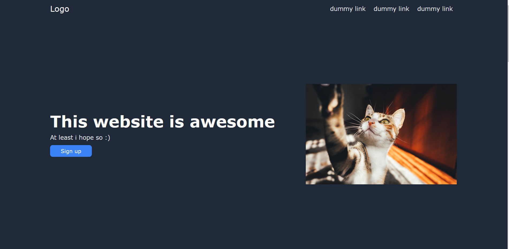
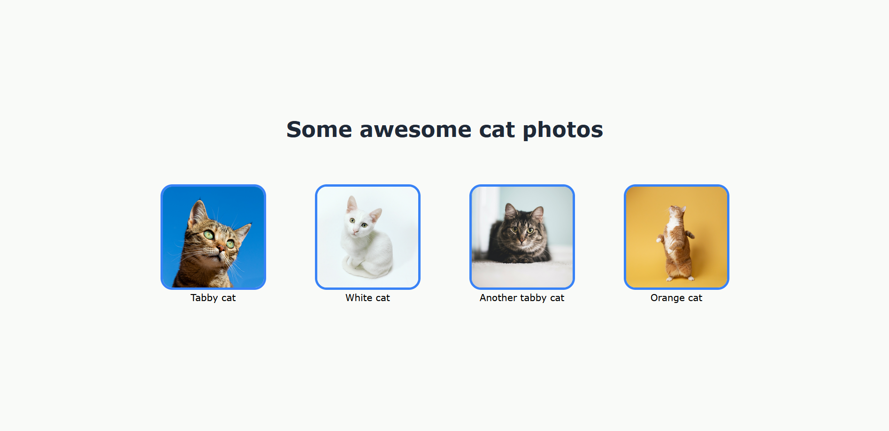
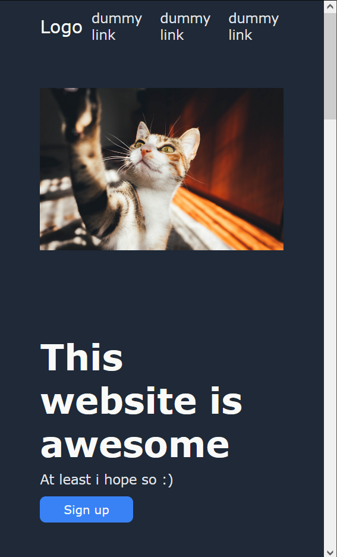
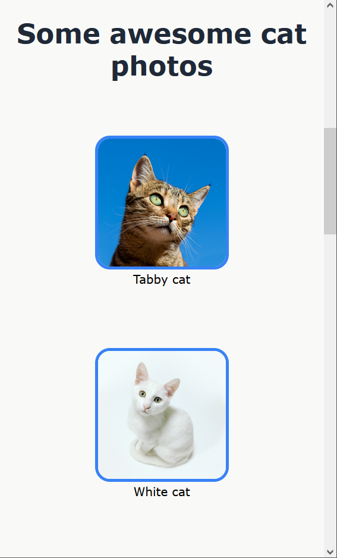

# odin-landing-page
## [Live demo](https://github.com/rubinduck/odin-landing-page)

Landing page project for [Odin Project](https://www.theodinproject.com) fondations course

# photo authors
1. Photo in first section:
- cat Photo by Halil İbrahim ÇETİN from Pexels

2. Four photos in second section:
- Photo by Cédric VT on Unsplash
- Photo by Rémi Rémino on Unsplash
- Photo by Kari Shea on Unsplash
- Photo by Kabo on Unsplash